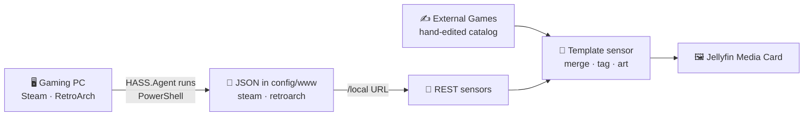

<div align="center">

# 🎮 Games Library Card — Sensors

**The Home Assistant sensors that feed the [Jellyfin Media Card](https://github.com/a4happy20/jellyfin-media-card) with your PC game library.**

They pull your installed **Steam** games and your **RetroArch** playlists off your PC, let you hand-add
**emulator / external** games, tag each item by library, and expose it all as one tidy, card-ready
template sensor.

[](LICENSE)
[](https://www.home-assistant.io/docs/configuration/packages/)
[](https://github.com/hass-agent/HASS.Agent)
[](https://github.com/a4happy20/jellyfin-media-card)

</div>

---

> [!IMPORTANT]
> **This is a Home Assistant configuration _package_ — not an integration and not a HACS add-on.**
> You don't install it through HACS. You copy some YAML into your own configuration, drop two
> PowerShell scripts onto your gaming PC, and (optionally) turn on Home Assistant's packages feature.
> 👉 [Configuration packages — Home Assistant docs](https://www.home-assistant.io/docs/configuration/packages/)

> [!NOTE]
> **Sensors only.** This repo gets your games *onto the card*. Actually **launching** a game
> (Steam / RetroArch / emulator) is covered in a separate repo and is out of scope here.

<br>

## Contents

- [What is this?](#what-is-this)
- [How it works](#how-it-works)
- [Prerequisites](#prerequisites)
- [Setup](#setup)
  - [Step 0 — Enable packages *(optional)*](#step-0--enable-packages-optional)
  - [Step 1 — Add the package file](#step-1--add-the-package-file)
  - [Step 2 — Put the scripts on your PC & set their paths](#step-2--put-the-scripts-on-your-pc--set-their-paths)
  - [Step 3 — Wire up HASS.Agent](#step-3--wire-up-hassagent)
  - [Step 4 — Add your secrets](#step-4--add-your-secrets)
  - [Step 5 — Add the fallback icon & custom art *(optional)*](#step-5--add-the-fallback-icon--custom-art-optional)
  - [Step 6 — Add your emulator / external games *(optional)*](#step-6--add-your-emulator--external-games-optional)
  - [Step 7 — Exclude from Recorder *(optional)*](#step-7--exclude-from-recorder-optional)
  - [Step 8 — Check config, restart & refresh](#step-8--check-config-restart--refresh)
- [The data the card receives](#the-data-the-card-receives)
- [Using it with the card](#using-it-with-the-card)
- [Troubleshooting](#troubleshooting)

<br>

## What is this?

A set of sensors that build **one merged, card-ready list of your PC games** from three sources, plus
two PowerShell scripts that do the actual scanning on your PC.

| Sensor entity | Pulls from | What it shows |
|---|---|---|
| `sensor.steam_games_list` | `steam_games.json` (REST) | Your installed Steam games — name, appid, description, art |
| `sensor.retroarch_games_list` | `retroarch_games.json` (REST) | Your RetroArch playlist games — label, rom, core, system, art |
| `sensor.external_games` | inline catalog (template) | Hand-added emulator / external games (Yuzu, CEMU, …) |
| `sensor.steam_card_data` | **the three above** | The final merged list, shaped exactly the way the card expects |

`sensor.steam_card_data` is the one you point the card at. Its `episodes` attribute is a merged,
de-duplicated, art-resolved list — with each entry tagged by its `library` (`steam`, `retroarch`, or
`emulator`).

<br>

## How it works

You're wiring up a short chain. Data flows left to right:



- **PowerShell scripts** (on your PC) do the scanning. `Get-SteamGames.ps1` reads your installed Steam
  games; `Get-RetroarchGames.ps1` reads your RetroArch playlists. Each writes a JSON file into Home
  Assistant's `config/www` folder (and RetroArch also copies matched artwork there).
- **HASS.Agent** runs those scripts on demand. Two Home Assistant `script:` entries press a HASS.Agent
  **button**, which runs the matching `.ps1` on the PC, then refreshes the REST sensor.
- **REST sensors** read the two JSON files back from `/local/...`.
- **The `External Games` template sensor** is a small catalog you edit by hand, for games that aren't in
  Steam or RetroArch (emulator titles, standalone launchers, …).
- **The `Steam Card Data` template sensor** merges all three, tags each entry by library, resolves
  artwork (with custom-art overrides and a fallback icon), de-duplicates by name, and keeps the last good
  list if a source briefly comes back empty (that's the caching).
- **The card** reads `sensor.steam_card_data` and renders it.

Once you understand these pieces, the setup steps below map cleanly onto them.

<br>

## Prerequisites

- A **Windows gaming PC** with **Steam** and/or **RetroArch** installed — this is where the scripts run.
- **[HASS.Agent](https://github.com/hass-agent/HASS.Agent)** installed on that PC and connected to Home
  Assistant, so HA can trigger the scripts. (This package uses its **Commands** feature.)
- **A way for the PC to write files into Home Assistant's `config/www` folder** — the scripts save
  `steam_games.json`, `retroarch_games.json`, and the copied RetroArch thumbnails there, and HA serves
  them at `/local/...`. See the callout below.
- *(Optional but expected)* the [Jellyfin Media Card](https://github.com/a4happy20/jellyfin-media-card)
  installed, so there's something to render the data.

> [!IMPORTANT]
> **The `config/www` path is specific to your setup — you must set it yourself.**
> In this project the scripts write to a **network-mapped drive** (e.g. `Y:\www\steam_games\...`, where
> `Y:\www` is Home Assistant's `config/www`). **Your PC almost certainly reaches HA differently** — a
> Samba/network share, a synced folder, running HA on the same machine, etc. Wherever you edit a path in
> the scripts, point it at **your** way of placing files into HA's config directory. As long as the file
> lands inside `config/www`, HA serves it at `/local/...`.

<br>

## Setup

**The whole process in a nutshell:**

1. Drop the package file into Home Assistant.
2. Put the two PowerShell scripts on your PC and set their paths.
3. Add HASS.Agent Commands + buttons that run them, and match the button names in the package.
4. Put the two JSON URLs in `secrets.yaml`.
5. *(Optional)* Add the fallback icon and any custom artwork.
6. *(Optional)* Hand-add emulator / external games.
7. *(Optional)* Keep the sensors out of Recorder.
8. Check the config, restart, and run a first refresh.

Each step is spelled out below. 👇

<br>

### Step 0 — Enable packages *(optional)*

<details>
<summary><b>Show me how to enable packages</b></summary>

<br>

> 📖 Reference: [Configuration packages — Home Assistant docs](https://www.home-assistant.io/docs/configuration/packages/)

In your `configuration.yaml`, tell Home Assistant to load a `packages` folder:

```yaml
homeassistant:
  packages: !include_dir_named packages
```

Then create the folder and file at `config/packages/games_library_card_sensors.yaml`.
*(If you already have a `homeassistant:` block, just add the `packages:` line under it.)*

**Or**, skip the folder and include this one file directly:

```yaml
homeassistant:
  packages:
    games_library_card_sensors: !include games_library_card_sensors.yaml
```

</details>

> [!TIP]
> Don't want to use packages at all? That's fine. Just place the **scripts**, **REST sensors**, and
> **template sensors** wherever they normally live in your configuration.

<br>

### Step 1 — Add the package file

Copy `games_library_card_sensors.yaml` into `config/packages/`.

<br>

### Step 2 — Put the scripts on your PC & set their paths

Copy `Get-SteamGames.ps1` and `Get-RetroarchGames.ps1` onto your gaming PC. Each has an
`# ---- EDIT THESE PATHS ----` block near the top — set those to match your machine.

**`Get-SteamGames.ps1`:**

| Variable | What it is |
|---|---|
| `$steam` | Your Steam install folder (the script also reads `libraryfolders.vdf` to find every other library) |
| `$outFile` | Where `steam_games.json` is written — **must land inside HA's `config/www`** |
| `$excludeAppIds` / `$excludeNames` | Optional: appids / names to leave out of the list |

**`Get-RetroarchGames.ps1`:**

| Variable | What it is |
|---|---|
| `$RetroArchExe` | Path to `retroarch.exe` (carried through to the card data for launching later) |
| `$PlaylistDir` | Your RetroArch `playlists` folder (`.lpl` files) |
| `$ThumbnailDir` | Your RetroArch `thumbnails` folder (Boxarts / Snaps / Titles) |
| `$OutFile` | Where `retroarch_games.json` is written — **must land inside HA's `config/www`** |
| `$ServeDir` | Folder the matched thumbnails are copied into — **inside HA's `config/www`** |
| `$ServeUrlBase` | The `/local/...` URL that `$ServeDir` is served at — **must match `$ServeDir`** |

> [!IMPORTANT]
> `$outFile`, `$OutFile`, and `$ServeDir` all need to resolve to a location **inside Home Assistant's
> `config/www`**, reached however *your* PC gets files there (see the [Prerequisites](#prerequisites)
> callout). And `$ServeUrlBase` must be the exact `/local/...` URL that `$ServeDir` maps to — e.g.
> `config/www/steam_games/ra_thumbs` ⇄ `/local/steam_games/ra_thumbs`.

> [!NOTE]
> **RetroArch artwork.** The script indexes your local thumbnails, matches each game by a normalized
> name, then **copies your matched art** into `$ServeDir` and serves it. So whatever RetroArch can show
> — official titles, rom hacks, hand-added art — shows on the card.
>
> **Steam artwork & descriptions.** Art comes from Steam's asset API with a CDN fallback; short
> descriptions are fetched once and **cached across runs**, so after the first run only newly installed
> games hit the API.

<br>

### Step 3 — Wire up HASS.Agent

In HASS.Agent on the PC, add a **Command** for each script (a PowerShell command that runs the `.ps1`),
and expose each as a **button** entity in Home Assistant.

The package's two `script:` entries press those buttons. Out of the box they target:

```yaml
# get_steam_games_list  →
button.press: button.a4happy20_steam_list_games
# get_retroarch_games_list  →
button.press: button.a4happy20_retroarch_list_games
```

> [!IMPORTANT]
> Your button entities are named after **your** HASS.Agent device, not `a4happy20`. Open
> `games_library_card_sensors.yaml` and change both `entity_id:` targets under the `script:` section to
> match the button names HASS.Agent actually created.

> [!NOTE]
> The scripts also carry `continue_on_error: true`, so a not-yet-created button won't abort the refresh
> while you're still setting things up.

<br>

### Step 4 — Add your secrets

The two REST sensors read their JSON over HTTP. Add the URLs to `secrets.yaml`, pointing at the files
your scripts write into `config/www`:

```yaml
steam_games_list:     http://YOUR_HA_HOST:8123/local/steam_games/steam_games.json
retroarch_games_list: http://YOUR_HA_HOST:8123/local/steam_games/retroarch_games.json
```

**What to swap out:**

| Placeholder | Replace with |
|---|---|
| `YOUR_HA_HOST:8123` | Your Home Assistant address and port |
| `/local/steam_games/...` | The `/local` path matching wherever your scripts wrote each JSON file |

> [!TIP]
> Paste each URL into a browser after your first run — if it returns JSON, the sensor will read it.

<br>

### Step 5 — Add the fallback icon & custom art *(optional)*

The card data sensor falls back to a placeholder image when a game has no art. Drop a
`steam_icon.png` into `config/www/steam_games/` so it resolves at `/local/steam_games/steam_icon.png`
(the default the template looks for).

Want to override art for specific titles? Edit the `custom_art` map inside the `Steam Card Data`
sensor — keyed by the **exact** game name. Custom art wins over every auto source:

```yaml

```

There's also an `exclude` list in the same sensor for names you never want on the card (by default it
drops the bare `RetroArch` launcher entry).

<br>

### Step 6 — Add your emulator / external games *(optional)*

For games that aren't in Steam or RetroArch, edit the `catalog` in the `External Games` sensor. Each
entry is keyed by the exact game name and describes how it's launched (used by the separate launching
repo — this package just lists them):

```yaml
"The Legend of Zelda: Breath of the Wild": {
  "exe": "C:/Games/CEMU - Breath of the Wild/cemu/Cemu.exe",
  "workdir": "C:/Games/CEMU - Breath of the Wild/cemu",
  "args": '-f -g "C:/Games/CEMU - Breath of the Wild/cemu/games/BOTW_EUR/code/U-King.rpx"',
  "pre_launch": ["D:/Programs/DS4Windows/DS4Windows.exe"]
}
```

| Key | Meaning |
|---|---|
| `exe` | The executable to run |
| `workdir` | Working directory to launch from |
| `args` | Command-line arguments |
| `pre_launch` *(optional)* | Programs to start first (e.g. a controller helper) |

> [!NOTE]
> These entries have no artwork of their own, so give them a `custom_art` entry (Step 5) or they'll show
> the fallback icon.

<br>

### Step 7 — Exclude from Recorder *(optional)*

These sensors can carry a lot of data. With big libraries, Recorder may log warnings about the volume.
If so, exclude them:

```yaml
recorder:
  exclude:
    entities:
      - sensor.steam_games_list
      - sensor.retroarch_games_list
      - sensor.external_games
      - sensor.steam_card_data
```

<br>

### Step 8 — Check config, restart & refresh

Go to **Developer Tools → YAML → Check Configuration**, fix anything it flags, then **restart Home
Assistant**.

For the **first population**, run each refresh script once so the PC actually generates the JSON:

- **Developer Tools → Actions** → run `script.get_steam_games_list` and `script.get_retroarch_games_list`
  (or press the HASS.Agent buttons directly).

Each script presses its button (running the `.ps1` on the PC), then updates the REST sensor. After that,
the REST sensors re-poll on their own (roughly daily), and the merge sensor holds onto the last good list
if a fetch briefly returns nothing.

<br>

## The data the card receives

`sensor.steam_card_data`'s `episodes` attribute is a list shaped exactly the way the card expects — one
object per game (the `series`/`season`/`episode` fields exist to match the card's schema; games use
placeholder values):

```jsonc
[
  {
    "id": "Game Name",
    "series": "Game Name",
    "season": 0,
    "episode": 0,
    "title": "",
    "overview": "Description (Steam) · core name (RetroArch) · blank (emulator)",
    "library": "steam",            // or "retroarch" or "emulator"
    "added": "",
    "series_art": "URL to the poster art",
    "episode_art": "URL to the wide art"
  }
]
```

**How art resolves** (custom art always wins, then the source's own art, then the fallback icon):

| Library | Poster (`series_art`) | Wide (`episode_art`) |
|---|---|---|
| `steam` | asset capsule, else the CDN `library_600x900.jpg` | asset header, else the CDN `header.jpg` |
| `retroarch` | matched boxart, else fallback icon | matched title image, else fallback icon |
| `emulator` | `custom_art`, else fallback icon | `custom_art`, else fallback icon |

You don't build this by hand — the sensors produce it. It's shown here just so you know what the card
is working with.

<br>

## Using it with the card

Once `sensor.steam_card_data` exists, add it to a card on your dashboard:

```yaml
type: custom:jellyfin-media-card
entity: sensor.steam_card_data
```

Every card option is documented in the
[Jellyfin Media Card README](https://github.com/a4happy20/jellyfin-media-card).

> [!NOTE]
> This card renders your library. Wiring up **tap-to-launch** for Steam / RetroArch / emulator games is
> handled in a separate repo — see the launching project for that side of things.

<br>

## Troubleshooting

<details>
<summary><b>Config check fails</b></summary>

<br>

YAML is whitespace-sensitive — indentation errors are the usual culprit. Read the exact line
**Check Configuration** points to, and make sure you're using spaces (not tabs).
</details>

<details>
<summary><b>A REST sensor is <code>unavailable</code> or stuck at <code>empty</code>/0</b></summary>

<br>

Work backwards along the chain:

1. **Did the script run?** Press the HASS.Agent button (or run the `script.`) and confirm the `.ps1`
   executed on the PC — each one prints how many games it wrote.
2. **Did the JSON land in `config/www`?** Check the file actually exists where your script's `$outFile` /
   `$OutFile` points, and that that location really is inside HA's `config/www`.
3. **Can HA serve it?** Open the `secrets.yaml` URL in a browser — it should return JSON. If not, the
   `/local/...` path doesn't match where the file was written.
</details>

<details>
<summary><b>The HASS.Agent button does nothing</b></summary>

<br>

Make sure the two `button.press` targets in the package's `script:` section match the button entity
names HASS.Agent actually created for **your** device (Step 3) — the defaults use the `a4happy20` device
name.
</details>

<details>
<summary><b>Images/artwork won't load</b></summary>

<br>

- Confirm `steam_icon.png` exists at `/local/steam_games/steam_icon.png` (the fallback).
- For **RetroArch**, make sure `$ServeDir` and `$ServeUrlBase` in the script point at the **same** served
  folder, and that the folder is inside `config/www`. Art is only copied for games whose name matched a
  thumbnail on disk.
- For **custom art**, the map key must be the **exact** game name.
</details>

<details>
<summary><b>Steam descriptions are missing</b></summary>

<br>

The description API is rate-limited. `Get-SteamGames.ps1` backs off on rate limits and caches results
across runs, so descriptions for a large freshly-installed library may fill in over a couple of runs.
Delisted or region-locked titles may have no description at all.
</details>

<details>
<summary><b>Recorder warnings about data size</b></summary>

<br>

Exclude the sensors from Recorder (see [Step 7](#step-7--exclude-from-recorder-optional)).
</details>

<br>

## License

Licensed under the [GNU General Public License v3.0](LICENSE).
